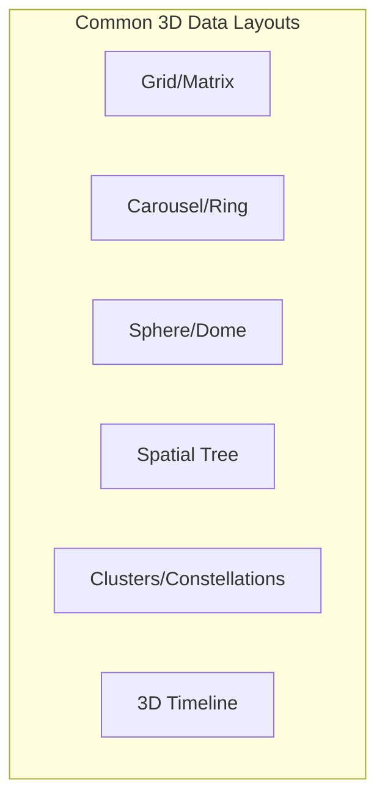
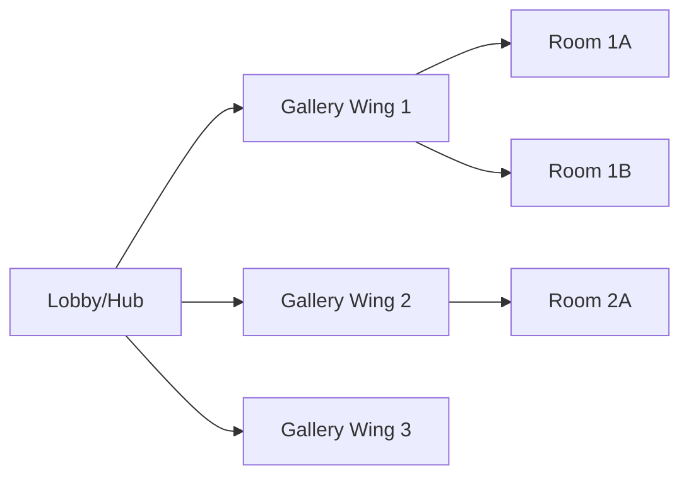

# 3D Spatial Navigation for Data Browsing: Research Summary

## Overview

This document synthesizes research and established patterns for how users navigate and interact with data in 3D/VR environments. These findings are relevant to upgrading the VR360Gallery system's navigation methodology.

---

## Core Navigation Paradigms

### 1. Egocentric vs. Exocentric Navigation

**Egocentric (First-Person)**
- User is inside the data space, looking outward
- Natural for immersive environments like 360 galleries
- Movement feels like physical locomotion
- Best for: Exploring environments, experiencing content

**Exocentric (Third-Person/World-in-Miniature)**
- User views data from outside, like examining a model
- Provides overview and context
- Easier spatial orientation
- Best for: Understanding structure, comparing items, organizing

**Hybrid Approaches**
- Allow switching between modes
- "Zoom in" to egocentric, "zoom out" to exocentric
- Example: Google Earth's seamless scale transitions

### 2. Spatial Data Layouts



#### Grid/Matrix Layout
- Items arranged in 2D or 3D grid
- Familiar from 2D interfaces
- Easy mental model
- Scales poorly with large datasets
- **Use case:** Small to medium galleries, category browsing

#### Carousel/Ring Layout
- Items arranged in a circle or cylinder around user
- Natural head rotation to browse
- Limited visible items at once
- Good for sequential browsing
- **Use case:** Featured content, playlists, recent items

#### Sphere/Dome Layout
- Items distributed on inner surface of sphere
- User at center, content surrounds
- Maximizes visible content
- Can cause disorientation
- **Use case:** Immersive galleries, star maps, panorama collections

#### Spatial Tree/Hierarchy
- Parent-child relationships shown spatially
- Branches extend in 3D space
- Natural for hierarchical data
- Navigation follows tree structure
- **Use case:** File systems, category hierarchies, organizational charts

#### Clusters/Constellations
- Related items grouped spatially
- Clusters positioned by similarity
- Organic, exploratory feel
- Requires good labeling
- **Use case:** Tag-based organization, semantic groupings

#### 3D Timeline
- Items arranged along temporal axis
- Can combine with other dimensions
- Intuitive for chronological data
- **Use case:** Photo galleries by date, historical archives

---

## Navigation Techniques

### Physical Movement Metaphors

| Technique | Description | Pros | Cons |
|-----------|-------------|------|------|
| **Teleportation** | Point and jump to location | No motion sickness, fast | Disorienting, breaks immersion |
| **Smooth Locomotion** | Continuous movement via controller | Immersive, precise | Motion sickness for some users |
| **Arm Swinging** | Swing arms to walk | Physical engagement | Tiring, imprecise |
| **Grab and Pull** | Pull world toward you | Intuitive, no sickness | Limited range |
| **Flying** | Free movement in any direction | Maximum freedom | Disorienting, hard to control |

### Selection and Interaction

| Technique | Description | Best For |
|-----------|-------------|----------|
| **Gaze + Dwell** | Look at item, wait to select | Hands-free, accessibility |
| **Ray Casting** | Point controller, press to select | Precision, distance selection |
| **Direct Touch** | Reach out and touch | Near-field, natural |
| **Voice Commands** | Speak to navigate | Hands-free, search |
| **Gesture Recognition** | Hand shapes trigger actions | Natural, expressive |

### Orientation and Wayfinding

**Landmarks**
- Distinctive visual elements for orientation
- Help users build mental maps
- Example: Unique gallery entrance designs

**Breadcrumbs**
- Visual trail showing navigation path
- Helps users retrace steps
- Can be 3D ribbons or floating markers

**Minimaps**
- Small overview showing current position
- Exocentric view while in egocentric mode
- Can be wrist-mounted or floating

**Compass/North Star**
- Fixed reference point
- Helps maintain orientation
- Can indicate "home" direction

---

## Research-Backed Best Practices

### From Academic Research

**Bowman et al. - 3D User Interfaces: Theory and Practice**
- Users prefer familiar 2D metaphors adapted to 3D
- Provide multiple navigation techniques for different tasks
- Minimize required precision for selection
- Support both novice and expert interaction styles

**Cockburn & McKenzie - Evaluating Spatial Memory**
- Spatial memory is powerful for recall
- Consistent layouts improve learning
- Users remember location better than labels
- Allow users to customize spatial arrangements

**Pausch et al. - Navigation in Virtual Environments**
- Physical rotation is more natural than virtual rotation
- Provide clear visual feedback during movement
- Limit degrees of freedom when possible
- Use acceleration curves, not constant speed

### From Industry Practice

**Meta Quest Design Guidelines**
- Keep important UI within 45 degrees of center view
- Use curved surfaces for large displays
- Provide haptic feedback for interactions
- Support both seated and standing use

**Apple Vision Pro Spatial Design**
- Content should feel grounded in space
- Use depth to show hierarchy
- Avoid placing content directly behind user
- Respect user's personal space (0.5m minimum)

**Google Immersive Design Guidelines**
- Use familiar patterns from 2D where possible
- Provide clear affordances for interactive elements
- Support progressive disclosure of complexity
- Design for variable attention spans

---

## Patterns for Gallery Navigation

### The Museum Model


- Central hub with branching galleries
- Physical metaphor users understand
- Clear hierarchy and wayfinding
- Supports both exploration and directed navigation

### The Carousel Model
- Items arranged in ring around user
- Swipe or rotate to browse
- Current item prominently displayed
- Adjacent items visible for context
- Good for sequential viewing

### The Constellation Model
- Items float in space, grouped by relationship
- User flies between clusters
- Organic, exploratory experience
- Best with search/filter to find specific items

### The Timeline Model
- Items arranged chronologically in space
- Walk through time
- Natural for date-organized galleries
- Can branch for different categories

---

## Recommendations for VR360Gallery

### Short-Term Improvements

1. **Implement Carousel Layout for VR Gallery Panel**
   - Replace flat grid with curved carousel
   - Items wrap around user at comfortable viewing distance
   - Swipe gesture or controller to rotate

2. **Add Teleportation Between Galleries**
   - Point at gallery, trigger to teleport
   - Brief transition animation
   - Maintain orientation

3. **Improve Spatial Feedback**
   - Highlight hovered items with glow/scale
   - Audio cues for selection
   - Haptic feedback on controllers

### Medium-Term Enhancements

1. **Implement Hub-and-Spoke Navigation**
   - Central lobby with gallery portals
   - Each gallery is a distinct space
   - Return to hub via gesture or button

2. **Add Minimap/Overview Mode**
   - Wrist-mounted or floating minimap
   - Shows all galleries and current position
   - Tap to teleport

3. **Support Multiple Layout Modes**
   - Grid for browsing
   - Carousel for viewing
   - Timeline for chronological exploration

### Long-Term Vision

1. **Spatial Memory Features**
   - Let users arrange galleries in personal layout
   - Remember user's preferred positions
   - Support bookmarks as spatial markers

2. **Semantic Clustering**
   - Group images by visual similarity
   - Create constellation view
   - AI-powered organization

3. **Social Presence**
   - See other users in shared space
   - Collaborative curation
   - Guided tours

---

## Technical Implementation Considerations

### A-Frame Components for Navigation

```javascript
// Existing A-Frame navigation components
AFRAME.registerComponent('teleport-controls', {...});
AFRAME.registerComponent('movement-controls', {...});
AFRAME.registerComponent('cursor-teleport', {...});

// Community components
// aframe-extras: movement-controls, sphere-collider
// aframe-teleport-controls: arc teleportation
// superhands: gesture-based interaction
```

### Performance Considerations

- **Level of Detail (LOD):** Show thumbnails at distance, full images when close
- **Frustum Culling:** Only render visible items
- **Lazy Loading:** Load images as user approaches
- **Instancing:** Reuse geometry for repeated elements

### Accessibility

- Support seated and standing modes
- Provide alternative to gaze-based selection
- Include audio descriptions
- Allow customizable interaction speeds

---

## Key Takeaways

1. **Leverage spatial memory** - Consistent layouts help users remember where things are
2. **Provide multiple navigation modes** - Different tasks need different approaches
3. **Use familiar metaphors** - Museums, carousels, timelines are understood
4. **Minimize motion sickness** - Prefer teleportation over smooth locomotion
5. **Support orientation** - Landmarks, minimaps, and breadcrumbs prevent disorientation
6. **Progressive complexity** - Simple by default, powerful when needed
7. **Physical comfort** - Keep content in comfortable viewing zones

---

## References and Further Reading

- Bowman, D.A., et al. "3D User Interfaces: Theory and Practice" (2004)
- LaViola, J.J., et al. "3D User Interfaces: Theory and Practice, 2nd Edition" (2017)
- Meta Quest Developer Documentation - Spatial Design Guidelines
- Apple visionOS Human Interface Guidelines
- Google AR Design Guidelines
- A-Frame Documentation and Examples
- WebXR Device API Specification
