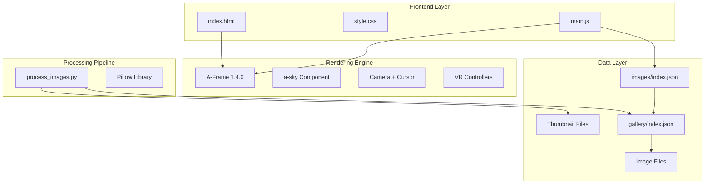
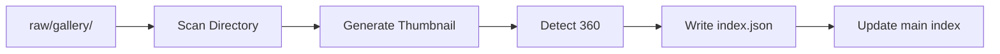

# VR360Gallery System Assessment

## Executive Summary

This document provides a comprehensive assessment of the vr360gallery system - a web-based 360-degree image gallery viewer with both 2D and VR display modes. The system uses A-Frame for WebXR rendering and implements a hierarchical gallery organization with automatic thumbnail generation.

---

## Architecture Overview



---

## Core Components

### 1. HTML Structure - index.html

**Purpose:** Single-page application shell containing both A-Frame scene and 2D UI overlay.

**Key Elements:**

| Element | Purpose |
|---------|---------|
| `a-scene#viewer` | Main A-Frame container with VR mode enabled |
| `a-sky#panorama-sky` | Displays 360 equirectangular images |
| `a-camera#main-camera` | User viewpoint with cursor for interaction |
| `a-cursor` | Gaze-based selection with fuse timeout of 1500ms |
| `#leftHand` / `#rightHand` | VR controller entities with raycasting |
| `#vr-gallery-toggle` | 3D button to open gallery in VR mode |
| `#vr-gallery-panel` | 3D floating panel for gallery selection in VR |
| `#gallery-overlay` | 2D thumbnail gallery at bottom of screen |
| `#gallery-controls` | Toggle button for 2D gallery visibility |
| `#keyboard-hint` | Displays keyboard shortcuts |

**Design Decisions:**
- Uses embedded A-Frame scene taking full viewport
- VR UI elements are hidden by default, shown only in VR mode
- 2D overlay uses fixed positioning at bottom of screen
- Includes Eruda debug console for mobile debugging

### 2. JavaScript Logic - main.js

**Purpose:** Application state management, gallery navigation, and dual-mode UI control.

**State Variables:**

```javascript
currentView = 'galleries' | 'images'  // Navigation state
currentSubdirectory = null            // Active gallery name
galleryVisible = true                 // 2D overlay visibility
currentImages = []                    // Images in current gallery
currentgalleries = []                 // List of all galleries
currentImageIndex = 0                 // Active image position
vrGalleryVisible = false              // VR panel visibility
isVRMode = false                      // Current display mode
```

**Key Functions:**

| Function | Purpose |
|----------|---------|
| `initGallery()` | Bootstrap application, load galleries |
| `loadgalleries()` | Fetch main index.json, render gallery list |
| `loadImagesFromSubdirectory(name)` | Load specific gallery images |
| `initAFrameViewer(path)` | Set panorama sky source |
| `is360Image(imageName)` | Detect 360 images via metadata or filename |
| `createThumbnail()` | Generate thumbnail DOM element |
| `renderVisibleThumbnails()` | Virtual scrolling renderer |
| `toggleGallery()` | Show/hide 2D overlay |
| `initVRGallery()` | Setup VR mode UI elements |
| `loadVRGalleries()` | Populate VR gallery panel |
| `nextImage()` / `previousImage()` | Sequential navigation |

**Virtual Scrolling Implementation:**
- Calculates visible range based on scroll position
- Only renders thumbnails within viewport plus buffer
- Recalculates on scroll and resize events
- Uses absolute positioning with transform for performance

**360 Image Detection Logic:**
```javascript
// Priority 1: Check is_360 property in metadata
if (typeof imageName === 'object' && 'is_360' in imageName) {
    return imageName.is_360;
}
// Priority 2: Filename pattern matching (legacy)
const name = imageName.toLowerCase();
return name.includes('360') || 
       name.includes('panorama') || 
       name.includes('equirectangular') ||
       name.includes('spherical');
```

**Keyboard Controls:**

| Key | 2D Mode | VR Mode |
|-----|---------|---------|
| G | Toggle gallery | Previous image |
| Tab | Toggle gallery | - |
| E | Next image | Next image |
| V | - | Toggle VR gallery |
| Escape | Back/close | Close VR gallery |
| WASD/Arrows | Rotate camera | Rotate camera |

### 3. CSS Styling - style.css

**Purpose:** Visual design for 2D interface with responsive breakpoints.

**Layout Strategy:**
- Full viewport black background
- Gallery overlay: 220px height, bottom-anchored
- Gradient background with backdrop blur
- Flexbox-based thumbnail grid

**Thumbnail Sizing:**
- Default: 120x120px
- Tablet (768px): 100x100px  
- Mobile (480px): 80x80px

**Visual Indicators:**
- `.is-360` class: Green border (#00ff88) with "360" badge
- `.active` class: Blue border (#007bff) with glow
- Hover states: Scale transform + shadow

**Accessibility Features:**
- Focus outlines for keyboard navigation
- High contrast mode support
- Reduced motion considerations via transitions

### 4. Image Processing - process_images.py

**Purpose:** Batch process raw images into gallery-ready format with thumbnails and metadata.

**Processing Pipeline:**



**360 Detection Algorithm:**
```python
def is_image_360(image_path):
    img = Image.open(image_path)
    width, height = img.size
    # Equirectangular: 2:1 aspect ratio, minimum 1000px wide
    return abs((width / height) - 2.0) < 0.1 and width > 1000
```

**Output Structure:**
- Thumbnails: 120x80px, prefixed with `thumb_`
- Gallery index: `{images: [{filename, is_360}]}`
- Main index: `{galleries: [gallery_names]}`

---

## Data Structures

### Main Gallery Index - images/index.json

```json
{
  "galleries": ["20250711", "20250712"]
}
```

**Schema:**
- `galleries`: Array of directory names containing image galleries
- Names are typically date-based (YYYYMMDD format)

### Gallery Image Index - images/{gallery}/index.json

```json
{
  "images": [
    {
      "filename": "example.jpg",
      "is_360": true
    }
  ]
}
```

**Schema:**
- `images`: Array of image objects
- `filename`: Original filename without path
- `is_360`: Boolean indicating equirectangular format

---

## File Organization

```
vr360gallery/
├── index.html              # Main application entry
├── css/
│   └── style.css           # All styling
├── js/
│   └── main.js             # Application logic
├── images/                 # Processed galleries
│   ├── index.json          # Gallery listing
│   └── {gallery}/          # Individual gallery
│       ├── index.json      # Image listing
│       ├── image.jpg       # Full resolution
│       └── thumb_image.jpg # Thumbnail
├── raw/                    # Source images for processing
│   └── {gallery}/
├── plan/                   # Documentation
├── process_images.py       # Processing script
└── requirements.txt        # Python dependencies
```

---

## Technology Stack

| Layer | Technology | Version | Purpose |
|-------|------------|---------|---------|
| 3D Rendering | A-Frame | 1.4.0 | WebXR framework |
| VR Support | WebXR | Native | VR headset integration |
| Image Processing | Pillow | Latest | Thumbnail generation |
| Debugging | Eruda | Latest | Mobile console |

---

## Current Limitations and Technical Debt

### UI/UX Issues

1. **Gallery naming**: Uses raw directory names (dates) instead of human-readable titles
2. **No image metadata display**: Title, description, date taken not shown
3. **Limited navigation feedback**: No loading indicators or progress
4. **Fixed thumbnail size**: Not optimized for different screen densities
5. **No search or filtering**: Cannot find specific images

### Architecture Issues

1. **Single JS file**: 778 lines without modularization
2. **No state management**: Global variables for application state
3. **Mixed concerns**: UI rendering and data fetching interleaved
4. **No error boundaries**: Failures can break entire application
5. **Hardcoded paths**: Image directory structure is fixed

### Performance Issues

1. **No image lazy loading for full images**: Only thumbnails use lazy loading
2. **No image preloading**: Next/previous images not prefetched
3. **No caching strategy**: Repeated fetches for same data
4. **Large panorama files**: No progressive loading or LOD

### VR Mode Issues

1. **Basic VR UI**: Simple boxes and text, no visual polish
2. **No haptic feedback**: Controller interactions lack tactile response
3. **Fixed panel position**: Gallery panel doesn't follow user gaze
4. **Limited controller support**: Basic raycasting only

---

## Strengths

1. **Dual-mode support**: Seamless 2D and VR experience
2. **Virtual scrolling**: Efficient handling of large galleries
3. **Automatic 360 detection**: Both metadata and heuristic-based
4. **Keyboard accessibility**: Full keyboard navigation support
5. **Responsive design**: Works across device sizes
6. **Simple deployment**: Static files, no server required
7. **Processing pipeline**: Automated thumbnail and metadata generation

---

## Recommendations for Upgrade

### Short-term Improvements

1. **Add gallery metadata**: Support titles, descriptions, cover images
2. **Implement loading states**: Skeleton screens, progress indicators
3. **Add image preloading**: Prefetch adjacent images
4. **Improve error handling**: Graceful degradation on failures

### Medium-term Refactoring

1. **Modularize JavaScript**: Split into ES modules
2. **Add state management**: Consider lightweight store pattern
3. **Implement caching**: Service worker for offline support
4. **Add image optimization**: Multiple resolutions, WebP format

### Long-term Enhancements

1. **Progressive panorama loading**: Low-res preview, then full quality
2. **Enhanced VR UI**: Curved panels, hand tracking, spatial audio
3. **Gallery management UI**: Web-based upload and organization
4. **Social features**: Sharing, comments, favorites

---

## Summary

The vr360gallery system is a functional 360-degree image viewer with solid fundamentals. It successfully implements dual-mode viewing (2D and VR), automatic image processing, and responsive design. The main areas for improvement are code organization, enhanced metadata support, and VR UI polish. The static file architecture makes it easy to deploy but limits dynamic features without additional backend infrastructure.
